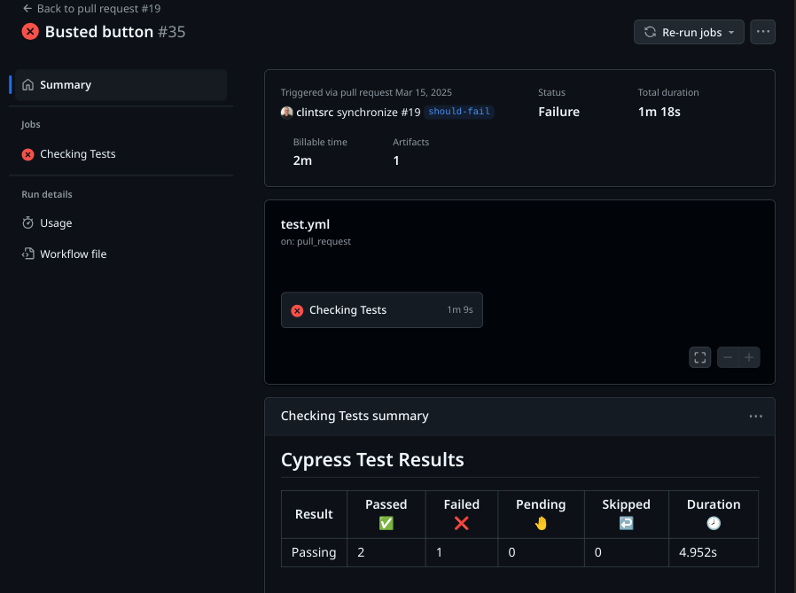

# On and On 

## Description

This project uses a CI/CD pipeline powered by GitHub Actions. It runs Cypress tests on pull requests targeting the development branch and triggers deployments when the development branch is merged into main.

   

## Table of Contents

- [Installation](#installation)
- [Usage](#usage)
- [License](#license)
- [Contributing](#contributing)
- [Tests](#tests)
- [Questions](#questions)

## Installation

1. Change to the project's root directory
2. Install the dependency modules: npm install
3. Build: npm run build
4. Configure the MongoDB database:
   - Create a server/.env (refer to the .env.EXAMPLE located there)
5. Seed the database: npm run seed

## Usage

1. Change to the project's root directory
2. Start the application: npm run start:dev
3. Refer to the [Tests](#tests) section to execute the Cypress tests.
4. See the [spec](client/assets/docs/spec.md) for the details of the original requirements
   - See the On and On live deployment hosted on Render [here](https://onandon.onrender.com)

## License

This application is covered under the [MIT](https://opensource.org/licenses/MIT) license

## Contributing

Guidelines:  
Ensure your code follows the project's coding standards.  
Write clear and concise commit messages.  
If your changes include new features, please update the documentation accordingly.  
If you are fixing a bug, please include a test to verify the fix.  
Thank you for your contributions!

## Tests

Test instructions:

1. Change to the project's root directory
1. Cypress requires the application under test to be running (see [Usage](#usage))
1. Run the tests in console mode: npm run test-component
1. To launch the test runner UI instead use: npm run test-gui

Here are some suggested scenarios:

- Create a feature branch. Make a change. Create a PR from the feature branch to develop. Verify that the Cypress tests execute and that the summary shows the report correctly.
- Create a PR from the development branch to main. The deployment script runs but the actual Deploy step is skipped. Next merge the branch to close the PR. The deployment script runs, and this time the Deploy step uploads the source to Render [Render](https://onandon.onrender.com) where it is built and started.
- Create a local branch from the develop branch. Commit the changes attempt to push the change directly to develop: the branch is protected and the push is blocked. Run the same steps for the main branch and expect the same result.
- Make a change on a local feature branch that will cause the Cypress tests to fail. Create a pull request for the feature branch to the develop branch: expect that the summary shows a failure and that you are unable to click Merge pull request. Fix the broken code, then check the PR again: expect that you are now allowed to click the Merge pull request button.

## Questions

If you have any questions, feel free to reach out:

- GitHub: [clintsrc](https://github.com/clintsrc)
- Email: clinton.alan.jones@gmail.com
